<!--
  PROFILE README — jethajiiii/jethajiiii
  Widths 370 / 490 keep the ASCII portrait and 3D wordmark at the exact same visual height.
-->

<!-- hero: monochrome ASCII portrait (types in) beside the extruded 3d ascii
     wordmark (wipes in left-to-right, then rocks on its vertical axis). -->

<h3><code>jethajiiii@github ~ $ Mukul Bhardwaj</code></h3>

<table>
<tr>
<td valign="top"></td>
<td valign="top"></td>
</tr>
</table>

 
 

<!-- animated contribution graph: real data, boxes reveal cell by cell
     (regenerated daily by .github/workflows/update-profile-art.yml) -->

<h3><code>jethajiiii@github ~ $ ./contributions.sh</code></h3>

 
 

<h3><code>jethajiiii@github ~ $ ./links.sh</code></h3>

<b>Full-Stack Developer · Real-Time Systems</b>

 
 

<h3><code>jethajiiii@github ~ $ cat about.txt</code></h3>

Full-stack developer who enjoys building reliable, real-time web applications and solving 
complex engineering problems. Hands-on experience across frontend, backend, and foundational 
DevOps, with a growing focus on system design and backend engineering. 300+ problems solved 
on LeetCode &amp; GeeksforGeeks across 10+ contests.

 

<h3><code>jethajiiii@github ~ $ ./stack.sh</code></h3>

 

<h3><code>jethajiiii@github ~ $ ls ./projects</code></h3>

<table width="100%">
<tr>
<td width="33%" valign="top">

**AaoChale — Ride Booking Platform**
Scalable MERN ride-hailing platform with RBAC + JWT auth, a real-time Socket.io GPS pipeline (10s broadcast intervals), and cryptographic OTP verification. React-Leaflet live tracking, 60fps GSAP animations, ~70% fewer geocoding requests via debouncing.

</td>
<td width="33%" valign="top">

**GoAlong — Logistics Marketplace**
Full-stack P2P logistics marketplace (React 19 + Express 5 + MongoDB) with a 6-state shipment lifecycle, Haversine geospatial matching, JWT refresh rotation + Google OAuth, live chat, GPS tracking, and a 3-stage Razorpay escrow flow with HMAC verification.

</td>
<td width="33%" valign="top">

**Draw.us — Collaborative Whiteboard**
Real-time infinite-canvas whiteboard + WebRTC video chat supporting 20+ concurrent users at sub-150ms latency. Turborepo monorepo decoupling Next.js, a WebSocket signaling server, and a PostgreSQL/Prisma backend, cutting build/deploy time ~35%.

</td>
</tr>
</table>

 

